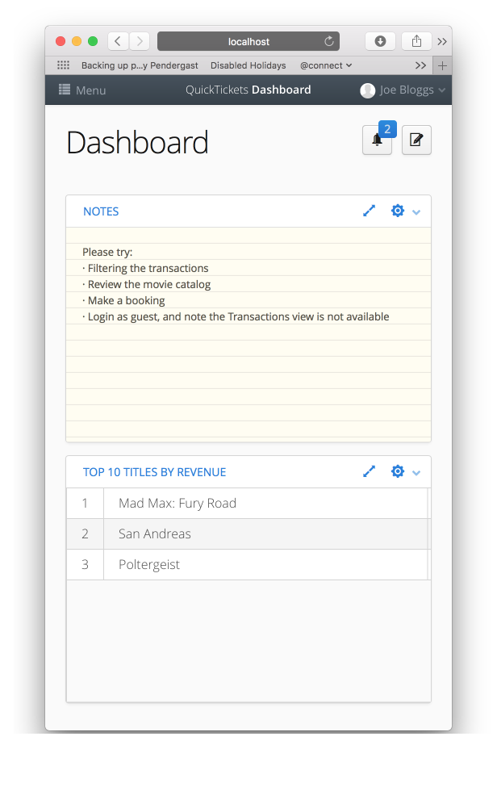

|  |
|:---:|
||

# Desktop and Admin Rapid Application Development
The goal of this project was to look for a development model that supports rapid development of desktop/admin/crud style 
web applications.  Ideally, a Java development background would be required but minimal JS/CSS/HTML.

 - Fast development
 - Minimise boilerplate code
 - BDD/TDD
 
This project demonstrates Spring Boot with Vaadin, but a number of other projects were considered.

## Investigated Projects and Technology
Earlier investigations looked into a few frontend technologies including Angular, Vaadin, JSF/PrimeFaces, Groovy on
Grails.  

While Groovy has some great features which reduce boilerplate code, many of them can be addressed by Java 8 language 
features and [Project Lombok](https://projectlombok.org).  Compared to Java 8, it still has some nice features 
- namely with() blocks, and multiline strings.

Springboot, Lombok and JPA gives most of the features of Groovy on Grails we need, while keeping us grounded in 
standard Java.

### RIA Frameworks
A number of different frameworks were investigated.

#### Angular
Angular would require a skills split of Java plus JavaScript/Angular.  For some projects this could be a really good
choice; ensuring that the presentation logic is completely decoupled from the server.  But my goal was to get as close
to Java-only as possible.

If looking at Angular, try [NGX-Admin](https://github.com/akveo/ngx-admin) which provides a great desktop layout and
set of components.

#### JSF
When evaluating JSF/PrimeFaces, I came across some interesting projects and examples such as 
[Admin Faces](https://github.com/adminfaces) which looks very promising.  The 
[online demo](https://adminfaces-rpestano.rhcloud.com/showcase/index.xhtml) is also illustrative of what is possible 
with JSF.  But under the hood there is a lot of frontend work to customise the look and feel of the JSF site.
This requires a hybrid JSF/HTML/CSS/JS skill set; but really it requires JSF experience too.  Ultimately you need to
understand a lot more about how JSF and the web browser work together.  This may be a good fit for some teams, but 
again not quite the goal we were after.

From a user perspective; every time a link, menu item or similar is clicked, JSF reloads the page.  JSF is generally not
a single page application.  This can lead to a poor user experience, it doesn't feel very polished.

**JSF + SpringBoot + Primefaces**
* Can use SpringSession to allow us to scale out if we need to.  
* Use XHTML to define components; but its simple markup 
* Spring Boot tutorial/intro: https://auth0.com/blog/developing-jsf-applications-with-spring-boot/

**JSF + JEE + Primefaces**
From JSF 2.3 (not yet released), JSF loses compatibility with Spring due to use of JEE CDI; 
so for a long lived product it would be worth looking at a JEE container for JSF.
  
Wildfly is a good EE server, which is packaged with Keycloak so we have some experience at Connect.
Wildfly Installation and IntelliJ Info : https://vimeo.com/91668238
  		
[Admin Faces Persistence Starter](https://github.com/adminfaces/admin-starter-persistence) is a useful head start.

#### Vaadin
Vaadin provides a Java-centric development model. There are add-ons specifically designed for 
[simple CRUD applications](https://vaadin.com/directory/component/crud-ui-add-on).  There are a number of 
demonstrations on line which you can review, 

* [Bakery App Demo](https://bakery.demo.vaadin.com/login.html), [Bakery App Architecture](https://vaadin.com/docs/-/part/bakeryfw8/architecture.html), source code is only available with a paid subscription.
* [JEE JPA Invoice App](https://github.com/mstahv/jpa-invoicer)
* [Dashboard Demo](https://demo.vaadin.com/dashboard/#!dashboard), [Source Code](https://github.com/vaadin/dashboard-demo) - this project is based on some of the user interfaces here.

Vaadin, PrimeFaces and AdminFaces all have a range of form components that you would require when building desktop
style applications.

For this investigation, Vaadin meets the goal of minimising CSS/JS/HTML development.

#### PrimeFaces vs Vaadin
The problems I identified with PrimeFaces were,
1. Lots of page reloads
2. Only partial ajax
3. To do anything useful you need good knowledge of JS+CSS and how to use it with Primefaces
4. Choice of Professional themes, but at a price.

Vaadin on the otherhand, gave you a much more professional feeling application straight away; is compatible with any 
framework (Spring/Boot, Play, JEE, etc), and has a vibrant ecosystem.

There are costs to consider for both.  With a $1200/year per developer license, Vaadin adds premium tools such as a designer, 
test framework, spreadsheet component, charts, and dashboard component.

Professional looking components from PrimeFaces will cost a one off payment of $1000.  Elite support is $99/developer/year and includes
bug fix releases. 

### Spring Boot vs JEE
Both JSF and Vaadin work well with Spring and JEE.  JEE combined with [Apache DeltaSpike](https://deltaspike.apache.org)
and [Weld CDI](http://weld.cdi-spec.org) provides most of the functionality of interest from the Spring ecosystem.

But we have already invested in Spring at work, so would prefer to stick with it. 

### Other RIA/RAD Helpful Libraries
#### Flyway  

On the one hand it handles database enhancements and migration which is obviously very important in a 
production system.  On the other, it means that developers need to define the table creation scripts and migration 
scripts.  This breaks the core Java skillset principle, but is necessary.  But it means simple bean creation that any 
junior developer could do, now needs SQL know how which perhaps they would not.  

With vanilla JPA/Hibernate no database creation is necessary - but database updates are much more difficult.  If only you could combine the two...?

#### Project Lombok
Interesting one this.  Reduce boiler plate (getters, setters, constructors) - POJOs just need a list of fields, no
getters or setters.

Sure, you can generate those easily with most IDEs, but they still cause clutter and maintenance.  Lombok fits right
in with the rapid application development goal.

#### [Viritin](https://github.com/viritin/viritin)
Viritin is a library for Vaadin which adds "fluent interfaces" to most components.  Again this cuts down on the 
verbosity of code.

#### Spring Boot
* Spring Boot is used to package and run the server application.  
* Spring Security is used to manage access to views.
* Spring Data is used to manage JPA access to the database.

### Testing
The project includes a sample of JUnit tests with Mockito which demonstrate testing UI components; that particular
fields are present and that particular behaviours occur when clicking buttons.  See BookingWindowTest.

The simple booking form was added to the application in under an hour, complete with simple unit test, integration test,
database table, bean, etc.

There are also Integration tests, which test that Flyway works correctly and that the tables created are compatible 
with JPA.

#### Differences to the official Vaadin Dashboard Demo
This demonstration is built in Vaadin 8, without the v7 compatibility layer.  It is built on Spring Boot, and uses a 
real database layer (H2, for development purposes).  It also makes greater use of Viritin and introduces Lombok and
unit testing.

It only includes some aspects of the Dashboard demo; enough to experiment with some of the technology described above.

Instructions
------------
Type,
    mvn spring-boot:run

